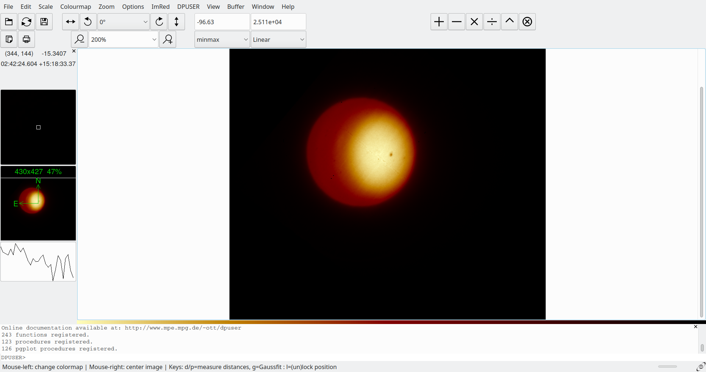
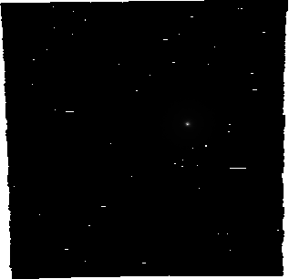

# Deconvolution of a single wavelength #

This example uses BASH scripting to invoke *aopp_deconv_tool*. To show graphical output we are using two FITS file viewers; [QFitsView](https://www.mpe.mpg.de/~ott/QFitsView/), and [DS9](https://sites.google.com/cfa.harvard.edu/saoimageds9). Each of these has their strenghts so it makes sense to use both when required.

## Setup ##

The first thing to do in define some constants for later use. We will also enable "strict mode" to make it easier to debug. However, if you are following along in an interactive session, it is suggested to **not** enable "strict mode".


```bash

# Use strict mode
set -o errexit -o nounset -o pipefail
IFS=$'\n\t'

SCRIPT="$(realpath -e ${0})"
SCRIPT_DIR=${SCRIPT%/*}
EXAMPLE_DIR="${SCRIPT_DIR}/../../../example_data/ifu_observation_datasets/"

SCI_FILE="${EXAMPLE_DIR}/single_wavelength_example_sci.fits"
STD_FILE="${EXAMPLE_DIR}/single_wavelength_example_std.fits"

STD_FILE_NORM="${STD_FILE%.*}_normalised.fits"
SCI_ARTEFACT_FILE="${SCI_FILE%.*}_artefactmap.fits"
SCI_ARTEFACT_MASK_FILE="${SCI_FILE%.*}_artefactmap_bpmask.fits"
SCI_INTERP_FILE="${SCI_FILE%.*}_interp.fits"
DECONV_FILE="${SCI_FILE%.*}_deconv.fits"
```

With that out of the way, we can move on to something more interesting.

## Looking at the data ##

To ensure that everything is set up correctly. Lets open the FITS files and ensure that they are what we expect.

NOTE: FITS files can have multiple extensions, if `QFitsView` is passed a file with multiple extensions it will ask you to select the one you want. To select the extension from the command-line, append `[<int>]` or `[<str>]` to the path. The first version uses the extension number, the second uses the extension name. Generally we will use the extension name. The first extension in a FITS file is always called PRIMARY.

```bash
ds9 ${SCI_FILE} &
ds9 ${STD_FILE} &
```

|science observation                 | standard star observation           |
|------------------------------------|-------------------------------------|
| |  |

The above images show that we at least have the correct input files. That's a good start. The deconvolution script `aopp_deconv_tool.deconvolve` requires a science observation and a file for the *point spread function* (PSF) of the observation. We are going to  use the standard star as our PSF. This is not optimal, but good enough for demonstration purposes. However, we must first get the standard star observation into the correct format.

## Normalising the PSF ##

The deconvolution script requires the PSF meets some basic requirements:

1. The PSF has an odd number of pixels in each direction.
2. The PSF is centered, meaning the brightest pixel is coincident with the center pixel of the image.
3. The brightness of the PSF sums to one.

We know that (2) is not met from the figures we created above. Using DS9 to grab the information we want
We can see from the header data that the standard star observation does not meet criteria (1), 


```bash
ds9 ${STD_FILE} -scale log -crosshair 200 200 physical &
```

Pixel value of standard star observation


Standard star observation header data excerpt
```bash
SIMPLE  =                    T / conforms to FITS standard                      
BITPIX  =                  -64 / array data type                                
NAXIS   =                    3 / number of array dimensions                     
NAXIS1  =                  317                                                  
NAXIS2  =                  306                                                  
NAXIS3  =                    1                                                  
EXTNAME = 'DATA    '           / This extension contains data values            
HDUCLASS= 'ESO     '           / class name (ESO format)                        
HDUDOC  = 'DICD    '           / document with class description                
HDUVERS = 'DICD version 6'     / version number (according to spec v2.5.1)      
```

The above shows that the standard star observation does not meet the PSF requirements. The image shows that a single pixel has a value larger than one, and the `NAXIS1` and `NAXIS2` keys in the header information show that at least one of the dimensions is not odd.

Thankfully, there is a script included in the package that will normalise a PSF so it obeys the constraints we require. The script is the `aopp_deconv_tool.psf_normalise module`. We can invoke it on the command-line, we will redirect the output into a log file to avoid cluttering the terminal.

```bash
python -m aopp_deconv_tool.psf_normalise ${STD_FILE} -o ${STD_FILE_NORM} &> ./logs/psf_normalise_log.txt

ds9 ${STD_FILE_NORM} -scale log -crosshair 200 200 physical &
```

Looking at the result, we can see that the standard star observation is not normalised and can be used as a PSF.

<table>
<tr>
<th>Normalised Image</th><th>Header excerpt</th>
</tr>
<tr>
<td>

</td>
<td>
<pre>
SIMPLE  =                    T / conforms to FITS standard                      
BITPIX  =                  -64 / array data type                                
NAXIS   =                    3 / number of array dimensions                     
NAXIS1  =                  317                                                  
NAXIS2  =                  305                                                  
NAXIS3  =                    1                                                  
EXTEND  =                    T                                                  
EXTNAME = 'DATA    '           / This extension contains data values            
HDUCLASS= 'ESO     '           / class name (ESO format)                        
HDUDOC  = 'DICD    '           / document with class description                
</pre>
</td>
</tr>
<\table>


## Deconvolving the image ##

As we have a normalised PSF, we now have everything we need to deconvolve the image. We use the command-line python script `aopp_deconv_tool.deconvolve`.


```bash
python -m aopp_deconv_tool.deconvolve ${SCI_FILE} ${STD_FILE_NORM} -o ${DECONV_FILE} &> ./logs/deconv-1-log.txt
```

## Comparing the result with the original ##

The resulting file has two extensions, a primary extension and another one that holds the residual. You can access a FITS file extension via its index, or via a name (if one was defined for it). In our case we know the name of the second extension is 'RESIDUAL' so we use that.

We can tell how well the deconvolution has gone by comparison between the original image, the deconvolved image, and the residual. Ideally, we are looking for the residual to be indistinguishable from background noise, and the deconvolved image to be an obviously "higher resolution" version of the original image.


```bash
ds9 ${SCI_FILE} ${DECONV_FILE} ${DECONV_FILE}[RESIDUAL]
```


| Original Image | Deconvolved Image | Residual |
|----------------|-------------------|----------|
| |  |  |


From the above results, a couple of things are apparent:

1. Both the deconvolved image and the residual look very similar.
2. There is still a large amount of signal left in the residual, approximately 24%.

This is indicative of not deconvolving the science image for long enough.


## Image is not completely deconvolved ##

The FITS file that holds the deconvolved image also has some useful data about the deconvolution, including why the deconvolution stopped, in its header (this information is also in the command-line output but we are not showing that for brevity). We can access the header of the FITS file and decide upon how to proceed depending upon why the deconvolution stopped.

FITS headers can hold key-value pairs in pairs of (PKEYn, PVALn), where n is a number, header entries. PKEYn holds the name of the key, and PVALn contains the value of that key. I know the information we are looking for the deconv.progress_string key so we will search for that in the FITS file, we will also search for the deconv.n_iter key which will tell us the maximum number of iterations that could have been performed.

```bash
ds9 ${DECONV_FILE}[RESIDUAL] -header save ./figures/deconv-file-header-1.txt -exit
grep 'deconv' ./figures/deconv-file-header-1.txt
```

```bash
PKEY6   = 'deconv.obs_file'                                                     
PKEY7   = 'deconv.psf_file'                                                     
PKEY8   = 'deconv.parameters_recorded_at_timestamp'                             
PKEY9   = 'deconv.n_iter'                                                       
PKEY10  = 'deconv.progress_string'                                              
PKEY11  = 'deconv.loop_gain'                                                    
PKEY12  = 'deconv.threshold'                                                    
PKEY13  = 'deconv.n_positive_iter'                                              
PKEY14  = 'deconv.noise_std'                                                    
PKEY15  = 'deconv.rms_frac_threshold'                                           
PKEY16  = 'deconv.fabs_frac_threshold'                                          
PKEY17  = 'deconv.max_stat_increase'                                            
PKEY18  = 'deconv.min_frac_stat_delta'                                          
PKEY19  = 'deconv.give_best_result'                                             
PKEY20  = 'deconv.clean_beam_sigma'                                             
```
